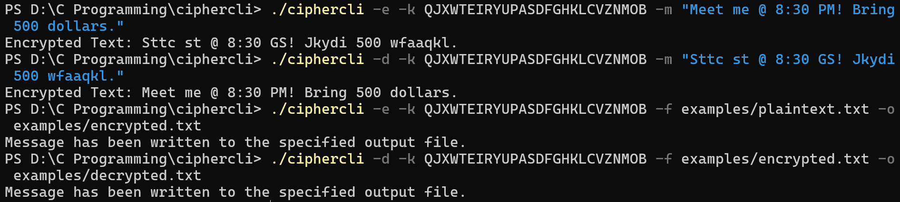

# CipherCLI

> A lightweight command-line utility written in C for encrypting and decrypting text using a monoalphabetic substitution cipher.

CipherCLI is a project built to explore command-line argument parsing, file handling, dynamic memory management, and modular software design in C.

Unlike a basic substitution cipher implementation, CipherCLI supports both encryption and decryption, terminal and file-based input, output redirection, comprehensive argument validation, and an optimized reverse lookup table for constant-time decryption.

---

## ✨ Features

- 🔐 Encrypt plaintext using a custom substitution key (either provided by user or generated by program)
- 🔓 Decrypt ciphertext using the same key
- 📄 Read input directly from the terminal
- 📂 Read single-line or multi-line input from text files
- 💾 Save encrypted/decrypted output to a text file
- 🔤 Preserve uppercase and lowercase characters
- 🔢 Preserve numbers, whitespace, punctuation, and special characters
- ⚡ Constant-time (`O(1)`) decryption using a reverse lookup table
- 🧠 Dynamic memory allocation for arbitrary-length file input
- 🛡️ Extensive command-line argument validation with descriptive error messages
- 🧩 Modular implementation using structures and reusable functions

---

## 📁 Repository Structure

```
ciphercli/
│
├── src/
│   ├── ciphercli.c
│
├── examples/
│   ├── plaintext.txt
│   ├── encrypted.txt
│   ├── decrypted.txt
│   ├── demo.png
│   ├── demo (1).png
│   └── demo (2).png
│
├── README.md
├── LICENSE
└── .gitignore
```

---

## ⚙️ Building

Compile using GCC:

```bash
gcc ciphercli.c -o ciphercli
```

Recommended compilation flags during development:

```bash
gcc -Wall -Wextra -Wpedantic -Wconversion -g ciphercli.c -o ciphercli
```

---

# 🚀 Usage

### Encrypt a message

```bash
./ciphercli -e -k <26 character key> -m <text message>
```

Output

```
CipherCLI: Encrypted Text: <encrypted text>
```

---

### Decrypt a message

```bash
ciphercli -d -k <26 character key> -m <encrypted text>
```

Output

```
CipherCLI: Decrypted Text: <decrypted text>
```

---

### Encrypt a text file

```bash
ciphercli -e -k <26 character key> -f <input file path> -o <output file path>
```

---

### Decrypt a text file

```bash
ciphercli -d -k <26 character key> -f <input file path> -o <output file path>
```

---

## 📝 Command-Line Options

| Option | Description |
|---------|-------------|
| `-e` | Encrypt input |
| `-d` | Decrypt input |
| `-k <key>` | Specify the substitution key |
| `-m <message>` | Read input directly from the command line |
| `-f <file>` | Read input from a text file |
| `-o <file>` | Write output to a text file |
| `-h` | Display the help menu |

---

## 🔑 Key Requirements

A valid substitution key must:

- Contain exactly **26 alphabetic characters**
- Contain every English alphabet exactly **once**
- Be case-insensitive

Example:

```
QJXWTEIRYUPASDFGHKLCVZNMOB
```

Invalid examples:

```
ABCDE
```

```
ABCDEFGHIJKLMNOPQRSTUVWXYZA
```

```
ABCDEFGHIJKLMNOPQRSTUVWXY1
```

```
AAAAAAAAAAAAAAAAAAAAAAAAAA
```

---

## 📌 Behaviour

- Only the English alphabet (`A-Z`, `a-z`) is substituted.
- Letter case is preserved.
- Numbers remain unchanged.
- Whitespace remains unchanged.
- Punctuation remains unchanged.
- Multi-line file input is fully supported.
- Dynamic memory allocation allows processing of arbitrarily large text files.

> **Note:** CipherCLI performs substitutions only on the English alphabet. Non-alphabetic characters are copied unchanged. On some Windows environments using the standard narrow-character runtime, non-ASCII Unicode characters passed through command-line arguments may not be preserved. UTF-8 file input (`-f`) is recommended when processing Unicode text.

---

# 📸 Demonstration

### Encrypting and Decrypting a Terminal Message and a Text File



---

### Invalid Key and Conflicting Command-Line Options

.png)

---

### Help Menu

.png)

---

## 🛠️ Implementation Highlights

- Written entirely in C
- Modular architecture using structures and reusable functions
- Robust command-line parser
- Dynamic memory management using `calloc()` and `realloc()`
- Forward and reverse substitution lookup tables
- Constant-time (`O(1)`) decryption
- File I/O using the C Standard Library
- Comprehensive validation of command-line arguments
- Clear and descriptive error handling

---

## 🚧 Future Improvements

Some planned enhancements include:

- Support for custom alphabets
- Frequency analysis utilities
- Batch processing of multiple files
- Unicode-aware implementation using wide-character APIs
- Makefile and cross-platform build support

---

## 📄 License

This project is licensed under the **MIT License**.

---

## 👨‍💻 Author

**rootaddictcoder**

If you found this project useful or interesting, consider giving the repository a ⭐.
